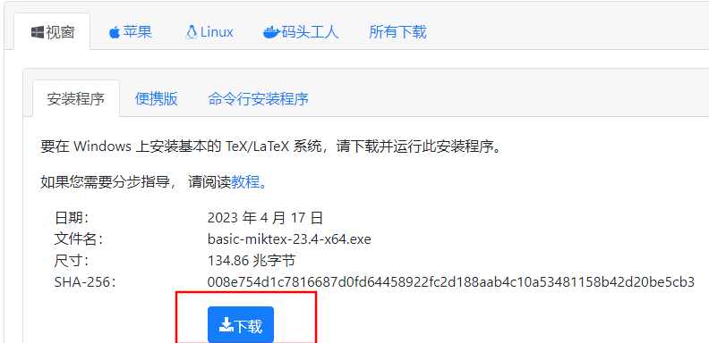
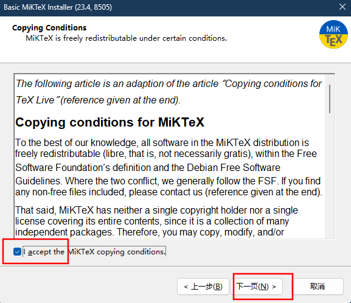
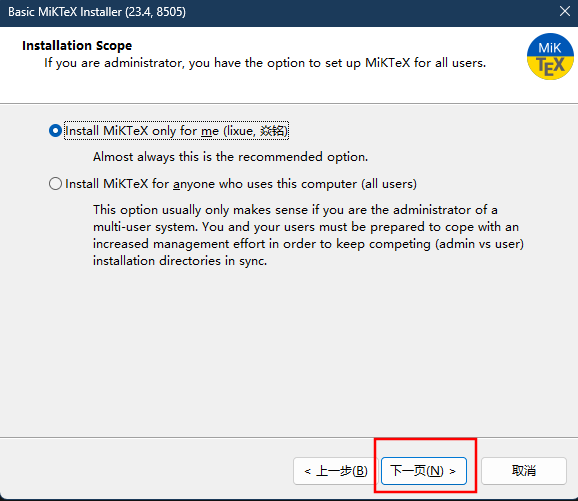
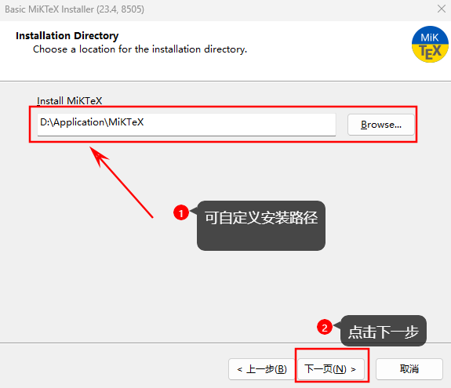
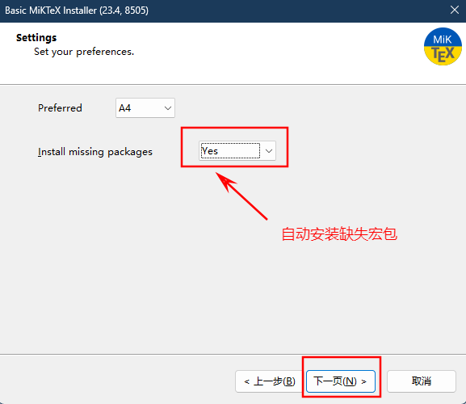
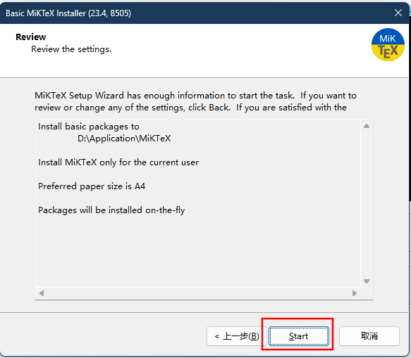
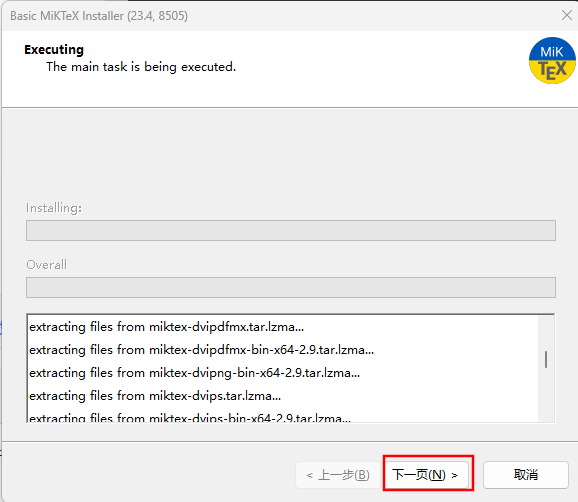
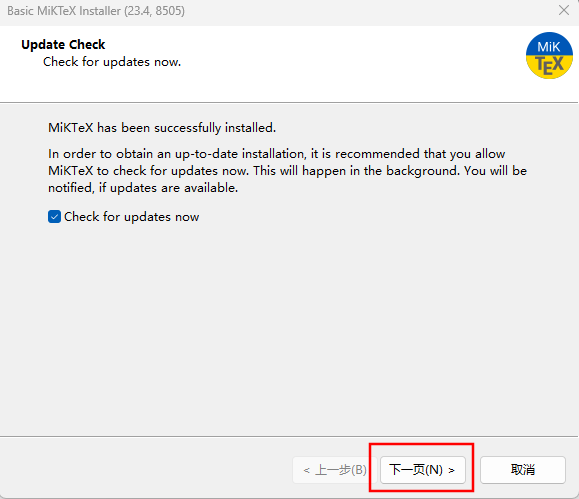

<!--
 *  =======================================================================
 *  ····Y88b···d88P················888b·····d888·d8b·······················
 *  ·····Y88b·d88P·················8888b···d8888·Y8P·······················
 *  ······Y88o88P··················88888b·d88888···························
 *  ·······Y888P··8888b···88888b···888Y88888P888·888·88888b·····d88b·······
 *  ········888······"88b·888·"88b·888·Y888P·888·888·888·"88b·d88P"88b·····
 *  ········888···d888888·888··888·888··Y8P··888·888·888··888·888··888·····
 *  ········888··888··888·888··888·888···"···888·888·888··888·Y88b·888·····
 *  ········888··"Y888888·888··888·888·······888·888·888··888··"Y88888·····
 *  ·······························································888·····
 *  ··························································Y8b·d88P·····
 *  ···························································"Y88P"······
 *  =======================================================================
 * 
 *  -----------------------------------------------------------------------
 * Author       : 焱铭
 * Date         : 2023-07-29 20:57:37 +0800
 * LastEditTime : 2023-07-29 21:08:48 +0800
 * Github       : https://github.com/YanMing-lxb/
 * FilePath     : \YM-VSCode-Configurations-for-LaTeX\Docs\MiKTeX安装教程.md
 * Description  : 
 *  -----------------------------------------------------------------------
 -->

# MiKTex安装
## 特点
-   安装过程简单，体积小
-   宏包自动安装、更新
-   MiKTex 可自动从Internet装载缺乏的组件。
## 下载安装

下载地址：[Getting MiKTeX](https://miktex.org/download)


### 安装过程
1. 双击运行，勾选协议，点击下一步；



2. 默认选项，点击下一步；



3. 设置安装路径，点击下一步；



4. 设置是否自动安装缺失的宏包；



5. 开始安装；



6. 下一步；



7. 下一步（安装完成后会自动检查更新）；



8. 完成安装。


## 检查更新

安装完毕之后，检查是否安装成功，`Win + R` 快捷键，输入 `cmd`， 打开命令行，输入`tex -version` ，cmd终端显示如下内容则表明MiKTex安装成功：

```
MiKTeX-TeX 4.5 (MiKTeX 23.4)
© 1982 D. E. Knuth; all rights are reserved.
TeX is a trademark of the American Mathematical Society
using bzip2 version 1.0.8, 13-Jul-2019
compiled with curl version 7.87.0; using libcurl/7.87.0 Schannel
compiled with expat version 2.5; using expat_2.5.0
compiled with liblzma version 50040002; using 50040002
compiled with libressl version LibreSSL 3.1.4; using LibreSSL 3.1.4
compiled with MiKTeX Application Framework version 4.7; using 4.7
compiled with MiKTeX Core version 4.20; using 4.20
compiled with MiKTeX Archive Extractor version 4.0; using 4.0
compiled with MiKTeX Package Manager version 4.9; using 4.9
compiled with uriparser version 0.9.7
compiled with zlib version 1.2.13; using 1.2.13
```

安装成功后，在“**所有程序**”中找到“**Miktex --> MikTex Console**”


双击打开，出现如下界面，点击 **"切换到MikTex管理员模式"** 


等待“**MikTex Console**”重新启动后，点击 “**检查更新**” 如下图所示。


选择“**更新 -->立即更新**”


到此，MikTex 彻底安装完毕。

**<font color="#d83931">注意</font>**：==如果在Windows平台下使用MiKTeX还需要安装[Perl语言解释器](http://strawberryperl.com/)，方可使用latexmk进行编译。==